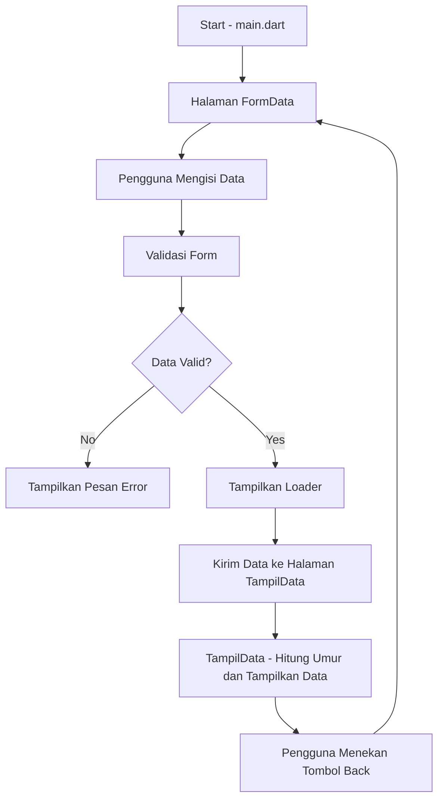

# Form Data Flutter App

[](https://flutter.dev/)
[](https://dart.dev/)
[](https://developer.android.com/)
[](https://developer.apple.com/ios/)

<table>
  <tr>
    <td style="text-align: center;">
      
    </td>
    <td style="vertical-align: middle;">
      <h5>Nama: Muhamad Galih</h5>
      <h5>NIM: H1D022052</h5>
      <h5>Shift: E (Baru)</h5>
    </td>
  </tr>
</table>

## Deskripsi

Aplikasi Flutter ini adalah sebuah form data sederhana yang memungkinkan pengguna untuk memasukkan dan menyimpan informasi seperti nama, NIM, dan tahun lahir. Aplikasi ini menggunakan tema warna yang bersih dan umum, memberikan pengalaman pengguna yang nyaman dan profesional.

## Fitur

- **Input Data**: Memungkinkan pengguna untuk memasukkan nama, NIM, dan tahun lahir.
- **Tema Bersih**: Menggunakan tema warna yang bersih dan profesional untuk desain yang konsisten.
- **Animasi**: Memiliki footer dengan animasi loader dan efek fade untuk meningkatkan pengalaman pengguna.

## Prerequisites

Sebelum memulai, pastikan Anda memiliki hal berikut:

- [Flutter](https://flutter.dev/docs/get-started/install) versi terbaru
- [Dart](https://dart.dev/get-dart) versi terbaru

## Instalasi

1. Clone repositori ini ke mesin lokal Anda:

    ```bash
    git clone https://github.com/muhgalihhh/Tugas2Praktikum2024/
    ```

2. Masuk ke direktori proyek:

    ```bash
    cd yourrepository
    ```

3. Install dependensi dengan perintah:

    ```bash
    flutter pub get
    ```

4. Jalankan aplikasi dengan:

    ```bash
    flutter run
    ```

## Struktur Proyek

- `lib/`
  - `main.dart`: Titik masuk aplikasi.
  - `ui/`
    - `tampil_data.dart`: File untuk menampilkan data yang dimasukkan pengguna.
    - `form_data.dart`: Formulir untuk memasukkan data pengguna.
   
## Demo Singkat Aplikasi

https://github.com/user-attachments/assets/f5bc60f6-718f-443c-bb7f-38453d9176ad


## Penjelasan Alur Data Aplikasi

Alur data dalam aplikasi ini mencakup beberapa tahap utama, yaitu input data, validasi, simulasi loading, pengiriman data ke halaman baru, dan tampilan data yang telah dimasukkan. Berikut adalah penjelasan setiap tahapannya:
### 1. **Inisialisasi Aplikasi (`main.dart`)**
Saat aplikasi dijalankan, `main.dart` adalah titik masuk. Di sini, `FormData` dipanggil sebagai halaman utama.

```dart
import 'package:flutter/material.dart';
import 'ui/form_data.dart';

void main() {
  runApp(const MyApp());
}

class MyApp extends StatelessWidget {
  const MyApp({Key? key}) : super(key: key);

  @override
  Widget build(BuildContext context) {
    return MaterialApp(
      title: 'Form Data App',
      theme: ThemeData(
        primarySwatch: Colors.blue,
      ),
      home: const FormData(), // Memanggil halaman utama FormData
    );
  }
}
```

### 2. **Input Data Pengguna (`ui/form_data.dart`)**
Pada halaman ini, pengguna mengisi **Nama**, **NIM**, dan **Tahun Lahir** menggunakan `TextFormField`. Setiap input dikendalikan oleh `TextEditingController`.

```dart
class FormData extends StatefulWidget {
  const FormData({Key? key}) : super(key: key);

  @override
  _FormDataState createState() => _FormDataState();
}

class _FormDataState extends State<FormData> {
  final _formKey = GlobalKey<FormState>();

  final TextEditingController _namaController = TextEditingController();
  final TextEditingController _nimController = TextEditingController();
  final TextEditingController _tahunLahirController = TextEditingController();

  @override
  Widget build(BuildContext context) {
    return Scaffold(
      appBar: AppBar(
        title: const Text('Form Data'),
      ),
      body: Padding(
        padding: const EdgeInsets.all(16.0),
        child: Form(
          key: _formKey,
          child: Column(
            children: <Widget>[
              TextFormField(
                controller: _namaController, // Mengambil input nama
                decoration: const InputDecoration(labelText: 'Nama'),
              ),
              TextFormField(
                controller: _nimController, // Mengambil input NIM
                decoration: const InputDecoration(labelText: 'NIM'),
              ),
              TextFormField(
                controller: _tahunLahirController, // Mengambil input Tahun Lahir
                decoration: const InputDecoration(labelText: 'Tahun Lahir'),
              ),
            ],
          ),
        ),
      ),
    );
  }
}
```

### 3. **Validasi Form**
Saat pengguna menekan tombol "Save", aplikasi memvalidasi apakah semua input sudah diisi dengan benar. Jika ada field yang kosong, pesan error akan ditampilkan.

```dart
void _saveForm() {
  if (_formKey.currentState!.validate()) {
    // Jika form valid
    Navigator.push(
      context,
      MaterialPageRoute(
        builder: (context) => TampilData(
          nama: _namaController.text,
          nim: _nimController.text,
          tahunLahir: int.parse(_tahunLahirController.text),
        ),
      ),
    );
  } else {
    // Jika form tidak valid
    ScaffoldMessenger.of(context).showSnackBar(
      const SnackBar(content: Text('Semua field harus diisi')),
    );
  }
}
```

### 4. **Simulasi Loading**
Setelah validasi berhasil, loader (`CircularProgressIndicator`) ditampilkan selama 2 detik untuk mensimulasikan proses penyimpanan data sebelum halaman baru muncul.

```dart
void _showLoaderAndNavigate() {
  showDialog(
    context: context,
    builder: (context) {
      Future.delayed(const Duration(seconds: 2), () {
        Navigator.of(context).pop(true); // Loader dihilangkan setelah 2 detik
        _saveForm(); // Melanjutkan ke halaman TampilData
      });
      return const Center(child: CircularProgressIndicator());
    },
  );
}
```

### 5. **Pengiriman Data ke Halaman Baru**
Setelah loader selesai, data dikirim ke halaman baru (`TampilData`) menggunakan `Navigator`. Di sini, data yang diinput (Nama, NIM, Tahun Lahir) akan diteruskan sebagai parameter ke halaman berikutnya.

```dart
Navigator.push(
  context,
  MaterialPageRoute(
    builder: (context) => TampilData(
      nama: _namaController.text,
      nim: _nimController.text,
      tahunLahir: int.parse(_tahunLahirController.text),
    ),
  ),
);
```

### 6. **Tampilan Data di Halaman Baru (`ui/tampil_data.dart`)**
Pada halaman `TampilData`, data pengguna ditampilkan. Selain itu, umur dihitung berdasarkan tahun lahir yang dimasukkan.

```dart
class TampilData extends StatelessWidget {
  final String nama;
  final String nim;
  final int tahunLahir;

  TampilData({
    required this.nama,
    required this.nim,
    required this.tahunLahir,
  });

  @override
  Widget build(BuildContext context) {
    int umur = DateTime.now().year - tahunLahir; // Menghitung umur

    return Scaffold(
      appBar: AppBar(
        title: const Text('Data Tampil'),
      ),
      body: Padding(
        padding: const EdgeInsets.all(16.0),
        child: Column(
          children: <Widget>[
            Text('Nama: $nama'),
            Text('NIM: $nim'),
            Text('Umur: $umur'),
          ],
        ),
      ),
    );
  }
}
```


## Diagram Alur Data

Berikut adalah diagram alur data yang menjelaskan bagaimana data bergerak dari satu tahap ke tahap lainnya di aplikasi:


### Alur Data Aplikasi:
1. **Start (`main.dart`)**: Aplikasi dimulai dari `main.dart` dan mengarahkan pengguna ke halaman `FormData`.
2. **Pengguna Mengisi Data**: Pengguna mengisi form dengan data Nama, NIM, dan Tahun Lahir.
3. **Validasi Form**: Aplikasi memvalidasi apakah semua field telah terisi.
4. **Data Valid?**: Aplikasi mengecek apakah data valid. Jika tidak valid, pesan error akan ditampilkan.
5. **Tampilkan Loader**: Jika data valid, aplikasi menampilkan loader selama 2 detik untuk mensimulasikan proses pengiriman data.
6. **Kirim Data**: Setelah proses simulasi loading, data dikirim ke halaman `TampilData`.
7. **TampilData**: Data pengguna (Nama, NIM, dan Umur) ditampilkan.
8. **Pengguna Menekan Tombol Back**: Pengguna dapat kembali ke halaman form untuk mengubah data jika diinginkan.

